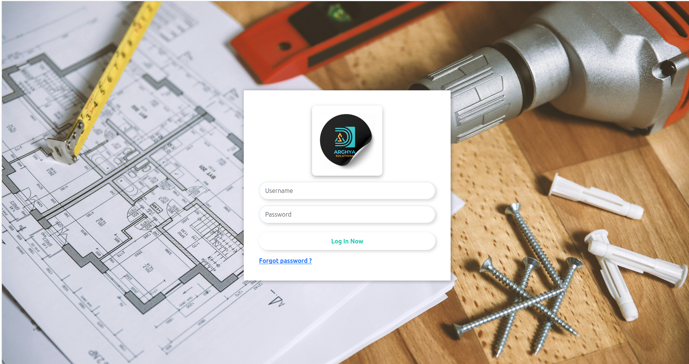
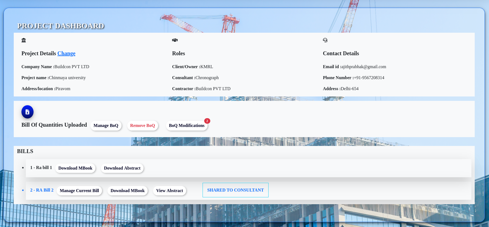
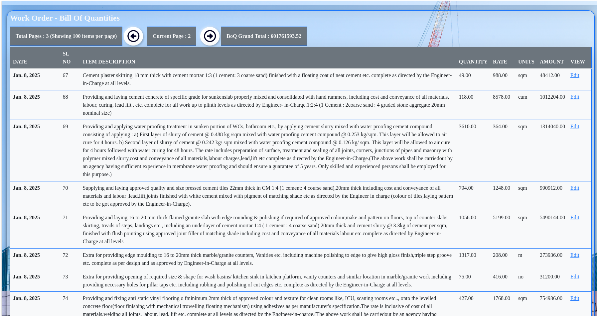
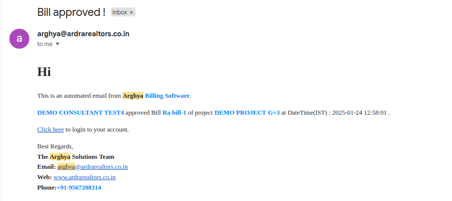
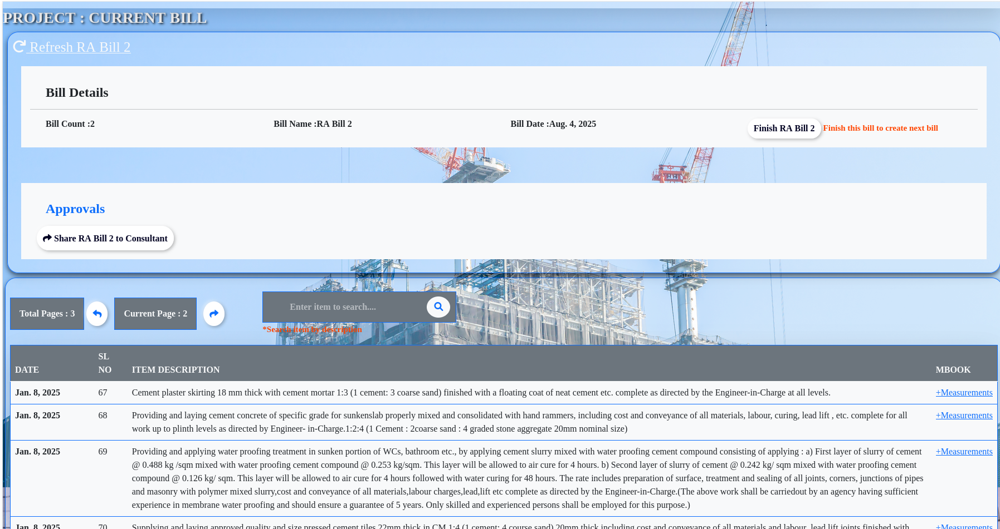
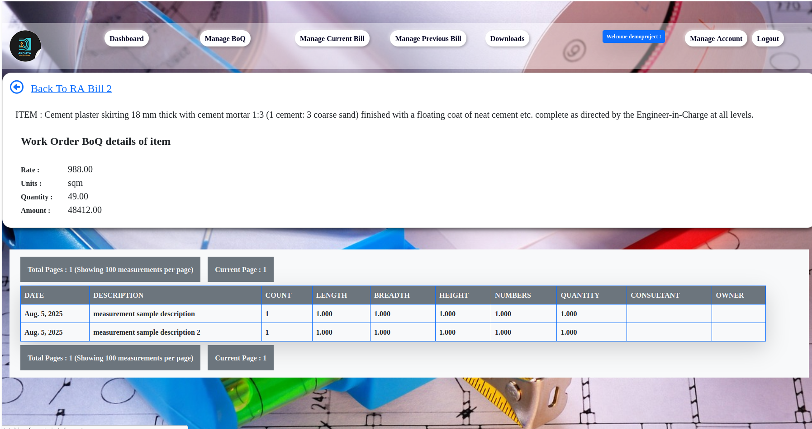
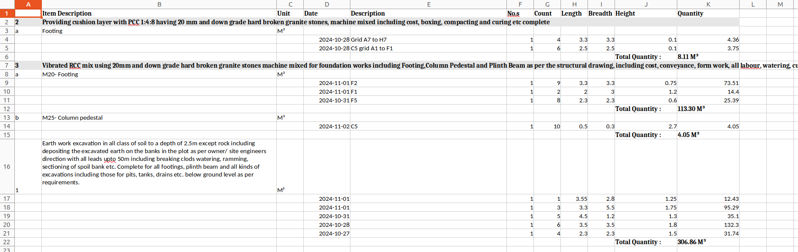

🏗️ Construction Project Billing & Account Management System

A robust, Dockerized Django web application designed to manage and automate the running bill account handling process for construction projects. It streamlines the creation of measurement sheets, abstract summaries, and GST-compliant tax receipts, while ensuring transparency and accountability throughout the billing lifecycle.

Key Features: 

    
    ⚡ This project uses Celery with Redis as the message broker to handle heavy background tasks.  
        One key task is **extracting and processing data from Work-Order Bill of Quantities (BOQ) Excel files** using Pandas. 
        
    📊 Automated Generation of measurement sheets, abstract excel reports, and tax receipts.

    📧 Email Notifications sent automatically to owners, consultants, and contractors at critical stages.

    ✅ Multi-stage Bill Approval Workflow with digital tracking of approvals and rejections,  with automated email sending.

    ⚙️ Asynchronous Task Management with Celery and Redis for background processing.

    🐳 Fully Dockerized setup for easy deployment and scaling.

## 💻 Screenshots

### Login page

###Project Dashboard

### Work order processing page

### Active bill management

### Sample Automated email

### MBook Management

### Approvals

### ActiveBill Management

### Sample measurement excel generated

## Only some sample codes are provided, not entire project

1. update .env with real values
2. clone the repo
3. generate ssl certificates
4. create volumes needed like certbot-etc
5. build and run docker files
6. Database is supposed to be seperately hosted. or if you wish add it as new service to docker-compose

    
